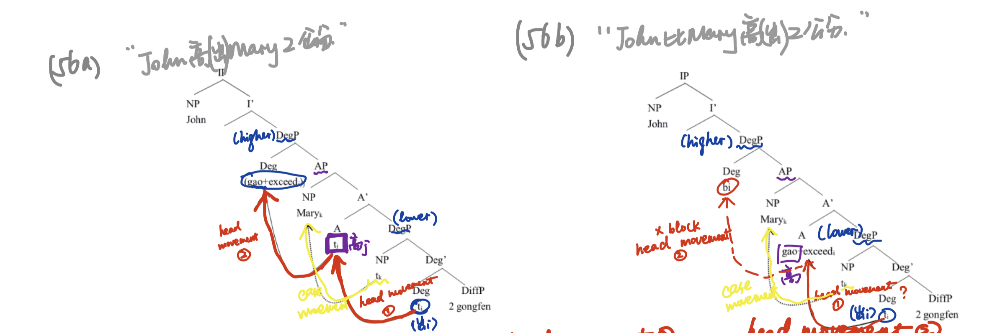
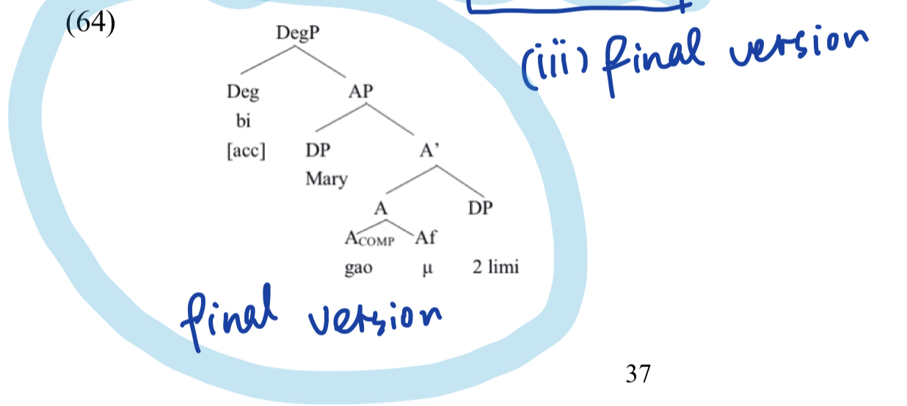
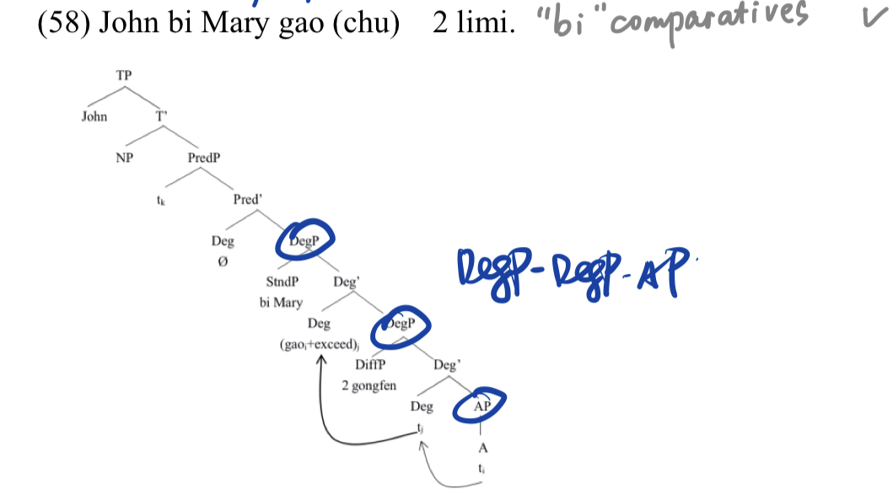
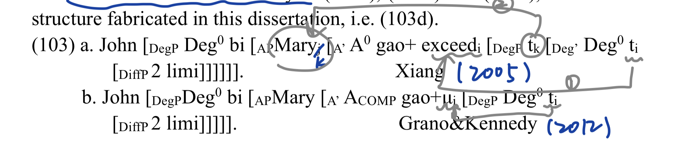
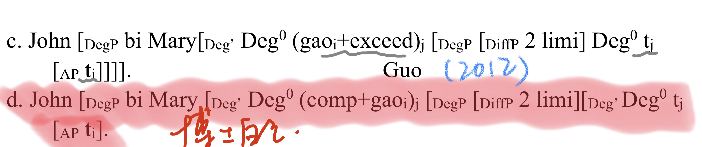
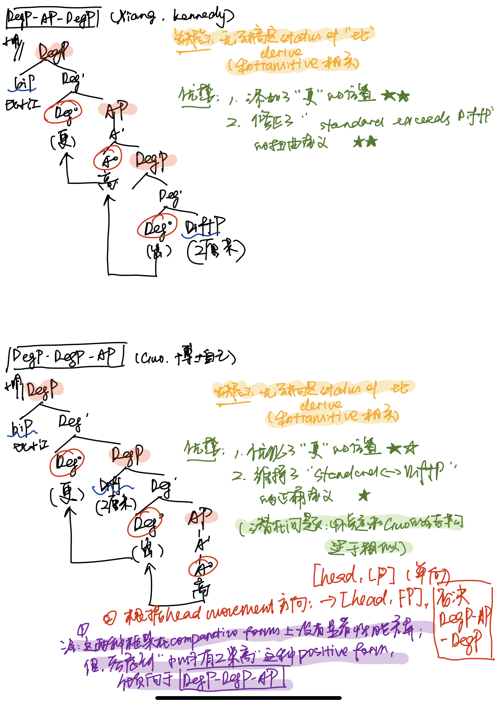

## 祖宗之法 [Done]

Abney: DegP hypothesis

> Abney, S. 1987. The English noun phrase in its sentential aspect[D]. Ph.D.  dissertation, Massachusetts Institute of Technology.

Richard Larson (1988b): DegP-shell (1991/2014)

> Larson, R. 1988b. On the Double Object Construction[J]. Linguistic Inquiry(19). 这里是VPShell

> Larson, R. 1991/2014. The Projection of DP and DegP[C]. On Shell Structure,  R.Larson, ed., New York: Routledge.这里是VPSehll套壳到DegPShell

## 外国中继者

Corver (1997)

> Corver, N. 1997. The internal syntax of the Dutch extended adjectival projection[J].  Natural language and linguistic theory(2)

Kennedy et al. (1997-2012)

> Kennedy, C. 1997. Projecting the adjective: The syntax and semantics of gradability  and comparison[D]. Ph.D. dissertation, University of California, Santa Cruz.

> Svenonius, P.&Kennedy, C. 2006. Northern Norwegian degree questions and the  syntax of measurement[C]. In Phases of interpretation, F. Mara, ed., Vol. 91 of  Studies in generative grammar. Berlin: Mouton de Gruyter. 

> Kennedy, C., &Levin, B. 2008. Measure of change: The adjectival core of degree  achievements. In Adjectives and adverbs: Syntax, semantics and discourse, ed.  Louise McNally and Christopher Kennedy, 156–182. Oxford: Oxford University  Press. 

## ==汉语应用者==

### 始祖

Liu，Chen-sheng (1996-2018)

### ~~Clausal analysis~~

### ==Phrasal analysis [Done]==

#### Xiang (2005) ~~【4.3.1】~~ ~~【2.5.3】~~

> Xiang, Ming. 2005, Some Topics in Comparative Constructions [D]. Ph.D.  dissertation, Michigan State University

> Li & Thompson (1981) summarized different types of Chinese comparatives. According to him, the basic pattern of Chinese comparatives is:                                   
>
> X    comparison    word Y   (adverb)    dimension												    			                                                                **(i) Superiority: "bi"	(他比你高)** (ii) Inferiority: "meiyou/buru...(name)" (他没有/不如你（那么）高) (iii) Equality: "gen...yiyang" （他跟你一样高）
>
> **本文只讨论(i)**

1. <u>==**unify "bi" comparatives and transitive comparatives [comparative forms-superiority-"bi" comparatives and transtitive comparatives]**==</u>

2. DegP-AP-DegP (这个结构本身顺序是不是就有问题)

   - <u>=="(比)" [head, (higher) DegP]==</u>
   - <u>“(出)” [head, (lower) DegP]</u> + DiffP [comp, (lower) DegP] （似乎架空了g.a.对DiffP的限制作用）+ Standard [spec, (lower) DegP] *(语义不对吧)*

3. *continuous head movements: (出) ->[obligatory] 高 ->[obligatory/block] op/比   【这个head-movement的机制不合理】*

4. *A-movement : Standard: [spec, (lower) DegP] -> [spec, AP] (好怪，没啥道理的样子）*

5. *engage no semantic discussions*  

   ->【总结】：

   ​		【核心缺陷】：

   1. Transitive comparatives: 没有解释位置三为什么是obligatory.    
   2. ==“更”去哪里了？？？（对位置一毫无描述）==      
   3. ==“出” introduces: Standard (specifier) & DiffP (complement) 这个语义太扭曲了-> "Standard exceeds DiffP"==                                          
   4. head-movement [head, FP] -> [head, LP]不合理             

> 

#### Grano & Kennedy (2012) ~~【4.3.1】~~ ~~【2.5.3】~~

> Grano, T.&Kennedy, C.. 2012. Mandarin transitive comparatives and the grammar of  measurement[J]. Journal of East Asian Linguist(21)

1. **==[positive forms]==;[comparative forms-superiority-==transitive comparatives &"bi" comparatives==]**

2. 

   - [positive forms] DegP-AP
   - [comparative forms] DegP-AP-DegP (这个结构本身顺序是不是就有问题) 【和positive forms不consistent】
     - ==<u>"(比)" [head, (higher) DegP]</u>==
     - <u>“μ/出” [head, (lower) DegP]</u> + DiffP [comp, (lower) DegP] 
     - final version (affixal status of “μ/出”) -> to relieve the unease of setting a null morpheme into Mandarin syntax

3. continuous head movements: μ/出 (final version: affix) ->[obligatory] 高 ->[obligatory/block] op/比   【这个head-movement的机制据说是为了给Mary accusative case，这合理吗？】

4. A-movement

5. Semantic ???

   ->【总结】：

   ​			【核心缺陷】：

   1. ==Positive forms 和 comparative forms 的DegP-AP/AP-DegP顺序不自洽==    
   2. Transitive comparatives: 用μ解释位置三为什么是obligatory太勉强了
   3. ==“更”去哪里了？？？（对位置一毫无描述）==     
   4. ==“高” introduces: Standard (specifier) & DiffP (complement) 这个语义太扭曲了-> "Standard 高（出） DiffP"==  

> 

#### ==Guo (2012)==  ~~【4.3.1】~~ ~~【2.5.3】~~

> Guo, Jie. 2012. Form and Meaning: Chinese Adjectives and Comparative  Constructions [D]. Ph.D. Dissertation, The Chinese University of Hong Kong.
>

1. **[comparative forms-superiority-"bi" comparatives]**

2. DegP-DegP-AP (这个结构顺序还挺合理的)

   - <u>null [head, (higher) DegP]</u>
   - <u>“(出)” [head, (lower) DegP]</u> + DiffP [spec, (lower) DegP] + AP [comp, (lower) DegP] 【(好像还挺好的)】

3. continuous head movements: 高 -> [obligatory] (出) -> [obligatory] null

4. A-movement

5. *No semantic engagement*

   ->【总结】：

   ​		【核心优点】：

   ​		1. “bi” comparatives 的句型都推得通

   ​		【核心缺陷】：

   1. ==“更”去哪里了？？？（对位置一毫无描述）==      
   2. transitive comparatives完全没有涉及

> 

> Gu&Guo (2011)

**(comparative forms)"一样" "出"** and (positive forms) "很" **-> same position of [head,DegP]**

> Guo (2015), Guo&Gu (2017)
>

**Revise status of "比" to a comitative preposition** 

#### 博士自己

1. **==[positive forms]==; [comparative forms-superiority-"bi" comparatives]**
2. 
   - [positive forms] DegP-AP
   - [comparative forms] DegP-DegP-AP (这个结构顺序还挺合理的)
     - <u>null [head, (higher) DegP]</u>
     - <u>“(更)” [head, (lower) DegP]</u> + DiffP [spec, (lower) DegP] + AP [comp, (lower) DegP] 【DiffP [spec, (lower) DegP] + “更+ g.a+出” [(compound) head, (lower) DegP] (好像还挺好的)】

3. continuous head movements: 高(出) ->[oligatory] (更) ->[obligatory] null
4. A-movement
5. ==Semantic engagement==

​		-> 【总结】：

​				【核心优点】：

​		    1. “bi” comparatives 的句型都推得通

​			【核心缺点】：

1. ==“更”的位置好奇怪（位置一好奇怪）==       
2. transitive comparatives完全没有涉及
3. ==语义计算：==
   - ==在下层DegP承担了所有比较义+（差值计算），上层DegP head语义做空，有一种明显的臃肿冗余感；==
   - ==小明比小红高2厘米，会计算出height(小明)**>=**height(小红)+2厘米的错误含义==

#### ==小结==		

 别人的：

我的：

#### ~~Lin, Jo-wang (2009, 2014, 2019) 【3.4.3】【4.3.2】~~

#### ~~Liu, Dan-qing (2012) 【无】~~
