​	

## Ch4 

## 4.1 DegP-shelled Structure and Degree-based Meaning

### 4.1.1 A Deg-shelled Analysis of COmparative Structure

博士的解决方案（2）

> 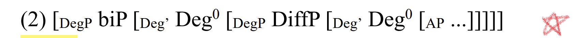

> 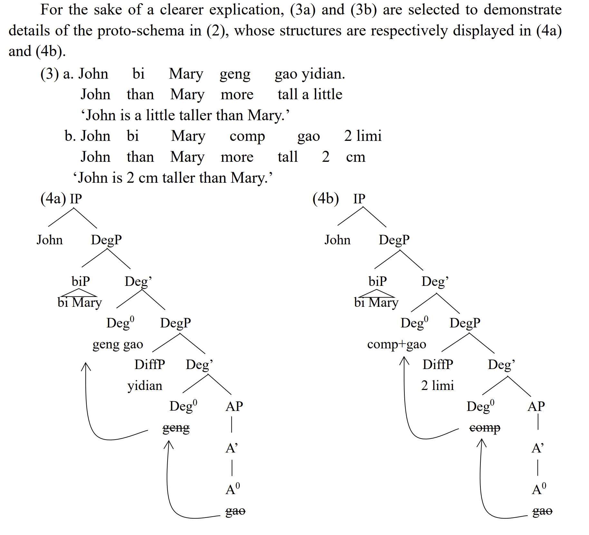

~~【DegP hypothesis插眼】~~

【DiffP插眼: ~~4.2.3~~ & theta-role (Zhang, 2002)】

~~【[head, AP] -> [head, (lower)DegP] 4.2.4 插眼】~~

the consensus reached by degree semanticists that standard phrases and differential phrases are introduced by Deg0 s.

### 4.1.2 A Degree-based Analysis of Comparative Structure

> 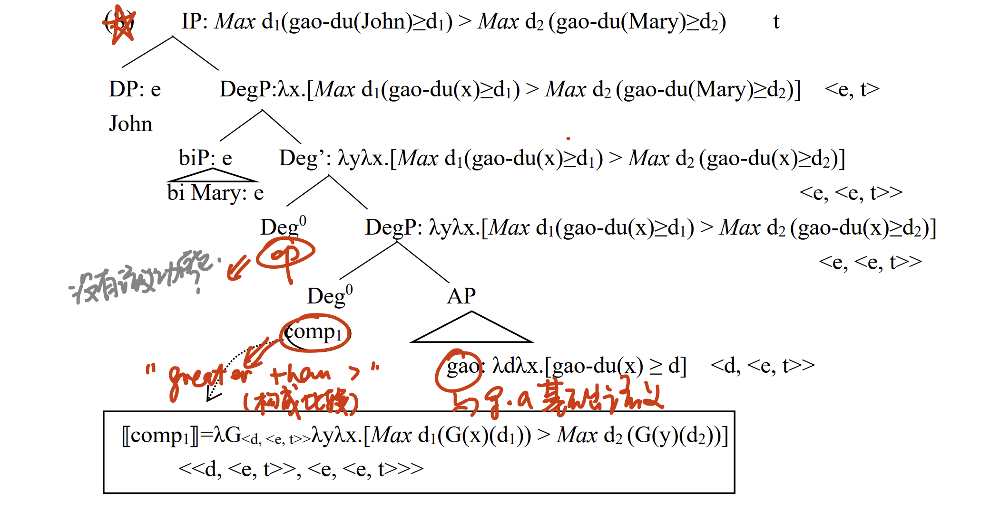

1. <u>lexical entry of gradable adjectives:</u>

> 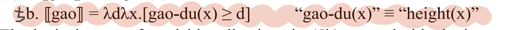

2. <u>lexical entry of comparative morpohemes (head of lower DegP):</u>
   - biP (phrasal status), no DiffP:

> 
>
> 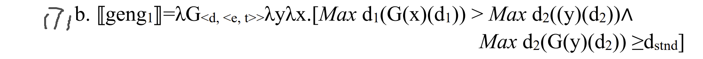

- biP (phrasal status), with DiffP:

> 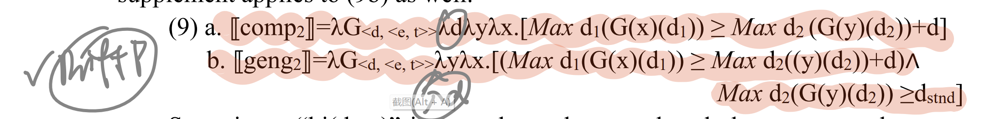

- biP (clausal status), no DiffP:

> 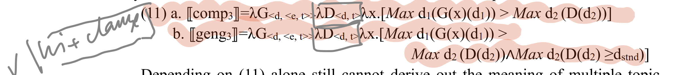

- biP (clausal status), with DiffP:

  [[comp4]]

  [[geng4]]

  

  *注：biP <e>/<d,t>*

  *注：DiffP <d>*

  3. <u>lexical entry of ? (head of higher DegP):</u>

## 4.2 DegP and Comparative Morphemes

### 4.2.1 What is DegP

==DegP hypothesis:==

> Abney in his famous doctoral dissertation “The English Noun Phrase in its Sentential Aspect” proposes two hypothesis, one is the well-known DP hypothesis, the other is DegP hypothesis, which states that DegP serves as a functional projection to license adjectives in syntax, and it embraces components like “this, that, so, as, too, how, enough, er, more”. Besides, it is assumed to adjoin at the above of AP, with modifiers like quantifier phrase “much” in (16a), measure phrase “six feet” in (16b), and differential phrases “2 inches” in (16c), base-generated at the specifier of DegP, The semantic requirement to bind the “degree” of gradable adjectives serves as the motivation behind DegP. 
>
> 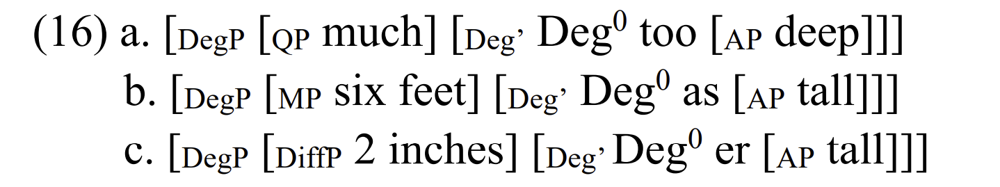

> Departing from the logic behind functional projection in formal linguistic field, a lexical NP, VP and AP must be respectively licensed by a functional D0 , I0 or Deg0 in syntax, and then project themselves into DP, IP and DegP, schematically (20):
>
> 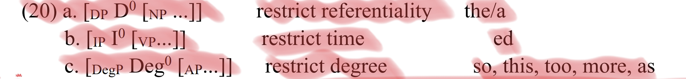
>
> These three types of functional morphemes are each instantiated as “the/a”, “-ed” and “so/er” in English. They share a common semantic function to bind the referentiality of lexical component they select. “referentiality” embodies itself respectively as the referent of nominal phrases, as the time of events (denoted by verbs), and as the degree of gradable adjectives.

### 4.2.3 A^0^ to Deg^0^ Movement

Motivation for head movement:[插眼，大概需要博士论文之外的资料了]

> 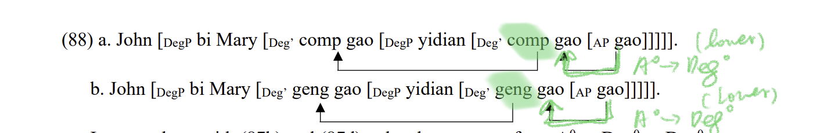
>
> In an analogy with (87b) and (87d), a head movement from A0 to Deg0 to Deg0 in comparatives is deemed feasible. ==The motivation triggering the movement of “gao(tall)” to lower Deg0 can be attributed to the introduction of differential phrases, e.g. “yidian(bit)” in (88a) and (88b). If “yidian (bit)” requires a theta role, “comp gao” or “geng gao” will be charged to assign one.== Since “comp gao” or “geng gao” bears the responsibility to introduce differential phrases, it is justifiable to explain why degree head and gradable adjectives play a decisive role on the selection of differential phrases in a cooperate way. ==<u>Then “comp gao” or “geng gao” moves to upper Deg0 to usher in “biP”.</u>==

类比使役结构：One of the key motivations behind (87b) and (87d) lies on the introduction of arguments and theta role assignment.

### ==4.2.4 Differential Phrases==

==[句法] [head, (lower)DegP]+[head, AP] -> (determines) DiffP==

Differential Phrases (DiffP）: 

- exact DiffP [eg.(degrees) 2厘米 2公斤 etc]
- vague DiffP
  - small degree DiffP [eg. 一点 一些 etc]
  - large degree DiffP [eg. 很多 etc]

gradable adejctives (g.a.):

- non-measurable g.a. [语义]  -> only vague DiffP [句法的restriction]
- measurable g.a. [语义] 	 -> excact DiffP & vague DiffP [句法的restriction]

comparative morphemes:

- “更” “稍微” “比较”, etc [语义]                       -> 特定的DiffP [句法的restriction]  
- equative morphemes: “一样” 【插眼，感觉有的可搞】[语义] -> 特定的DiffP [句法的restriction] 
- TABLE4 TABLE5

### ==4.2.2 Comparative Morphemes in Mandarin==

#### 4.2.2.1 Parallelism between much/more/most and hen/geng/zui

区分functional head (Degree head, Asp head“了”, etc.)和degree adebverbd的测试：

1. Functional head: no repetitive form
2. Functional head: can be modified DiffP/MP
3. Functional head: cannot be questioned by wh word.

#### 4.2.2.2 Null "comp(more4)" as a Comparative Morpheme

零形式/出/过/了(more productive)：suffix

1. optional
2. Compulsory DiffP (all types)

#### 4.2.2.3 "geng"-like Degree Adverbs as Comparative Morpheme 

comparative morphemes都有：更，还，多，稍微

“更”：语义上，“Mary hen gao (Mary is tall)”, this positive meaning is encoded into the lexical entry of “geng”. 句法上，要么没有diffP，如果有，就是小o。

“还”：语义上，有anti-expectation的含义。句法上没有要求。

“稍微”：语义上encode了slight degree of "greater than" meaning。句法上只能跟小o，并且必须跟小o。
$$
geng_2=λG_{<d,<e, t>>}λdλyλx.[Max d_1(G(x)(d_1)) \geq Max d_2((y)(d_2)) + d \\ \land Max d_2(G(y)(d_2)) ≥d_{stnd}]
$$
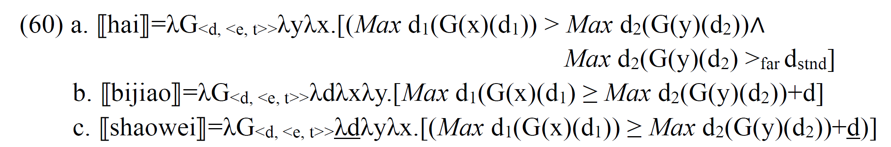

## Ch5

> **the null nature of I^0^ and Deg^0^** is undesirable for natural languages:
>
> -> [English] mechanism: an overt <u>agreement system</u> **to license these two null components**
>
> -> [Mandarin] mechamism: [in simple positive forms] overt <u>MP (temporal words)/degree verbs (frequent adverbs)/negative adverb</u> or [in non-simple positive forms] <u>functional projections in CP layer pertinent to degree (time)</u> **to license these two null components**

**<u>[语义]</u>** (仅涉及simple positive forms (不包括negative adverb))

1. <u>gradable adjectives:</u>

$$
(18a) [\![gao]\!]=\lambda d \lambda x.[height(x) \ge d] \qquad <\!<d, <e, t>\!>
$$

2. <u>Head of DegP</u> (Two variants of "pos": "pos~1~"and "pos~2~"):

   a. "pos~1~"

$$
(21) [\![pos_1]\!]=\lambda G_{<d,<e,t>>} \lambda x. \exist d [G(x,d) \wedge (d \ge d_{stnd})] \qquad <\!<d,<e,t>\!>,<e,t>\!>
$$

**很冗余，我觉得的表达式：**
$$
[\![pos_1]\!]=\lambda G_{<d,<e,t>>} \lambda x.[G(x,d_{stnd})] \qquad <\!<d,<e,t>\!>,<e,t>\!>\!>
$$
​	b. "pos~2~"
$$
(18b) [\![pos_2]\!] = \lambda G_{<d,<e,t>>} \lambda d' \lambda x.[G(x,d')] \qquad <\!<d,<e,t>\!>,<d<e,t>\!>\!>\!>
$$
​	c. interim summary:

> "pos~1~" -> Distribution: 其余所有地方
>
> ​			-> Function: i) type-shift function ii) evaluative meaning
>
> "pos~2~" -> Distribution：仅限于MP;
>
> ​			-> Function: 既没有type-shift function，也没有evaluative meaning
>

[^dstnd]: may refer to a **contextual standard degree** or **a specifc standard offered by the speaker

3. <u>Specifer of DegP:</u> 

   a. Degree adverbs -> Meaning: modification (not bleached)

   |                    |                                     | Meaning      | Position  |
   | :----------------- | ----------------------------------- | ------------ | --------- |
   | **Degree adverbs** | (monosyllable) 太，老，很，蛮，挺   | Modification | Specifier |
   |                    | (disyllable) 特别，非常，比较，一点 | Modification | Specifier |

   b. MP

4. *Adjunct of DegP(optioanl degree adverb <u>**[in English]**</u>) -> Meaning: modification (not bleached)* 
   $$
   [\![very]\!]=\lambda P.[P] \qquad <\!<e,t>,<e,t>\!>
   $$

5. <u>Semantic computation:</u>

   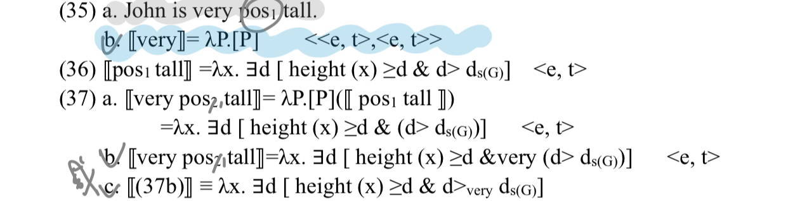

<u>**[句法结构]**</u> (仅涉及simple positive forms (不包括negative adverb))

​	a. （n) 小明 [~DegP~ 很/非常 [~Deg'~ pos~1~ [~AP~ 高]]]

​	b. （19a） 小明 [~DegP~ 2米 [~Deg'~ pos~2~ [~AP~ 高]]]

<u>**[Appendix]**</u>

1) 6 criterai conclused by scholars **<u>to define functional category</u>** (Abney, 1987; Ouhalla, 1991; An, 2012,etc.):

		1. a closed lexical class
		1. have c-selection (categorical selection) on their complements (eg. C^0^-IP, I^0^-VP, D^0^-NP)
		1. no s-selection (semantic selection) (i.e., they cannot assign a θ-role = they cannot introduce an argument)
		1. affixal status
		1.  inseparable from their complements (eg. their complements cannot be dropped when answer a question)
		1. lack descriptive content

2. complete list of strategies:

|                               | 组别        |                                                              | Position           | licensing effect        |                                       |
| ----------------------------- | ----------- | ------------------------------------------------------------ | ------------------ | ----------------------- | ------------------------------------- |
| **Simple positive forms**     | (1)         | MP                                                           | [Spec, DegP]       | MP                      | **MP**                                |
|                               |             | degree adverbs                                               | [Spec, DegP]       | degree adverbs          | **degree adverbs**                    |
|                               |             | negative adverb (不)                                         | [Spec, DegP]       | negative adverb (不)    | **negative adverb (不)**              |
|                               |             | ~~affimative adverb (确实)~~                                 | ~~[Spec, ForceP]~~ | ~~ForceP~~              |                                       |
|                               |             |                                                              |                    |                         |                                       |
| **Non-simple positive forms** | (2) "focus" | focus adverb (才)                                            | [Spec, AP]         | (null) FocusP           | **functional projection in CP layer** |
|                               |             | focus auxiliary (是)                                         |                    | FocusP                  |                                       |
|                               |             | focus constructions                                          |                    | FocusP                  |                                       |
|                               |             | stress to g.a.                                               |                    | FocusP                  |                                       |
|                               |             | contrastive focus                                            |                    |                         |                                       |
|                               |             |                                                              |                    |                         |                                       |
| **Non-simple positive forms** | (3)         | <u>affimative adverb (确实)</u>                              | [Spec, ForceP]     | ForceP                  | **functional projection in CP layer** |
|                               | SFP         | yes-no interrogatives (吗)                                   |                    | ForceP                  |                                       |
|                               | SFP         | *wh* interrogatives (呢)                                     |                    | ForceP                  |                                       |
|                               | SFP         | exclamatory sentences (啊)                                   |                    | ForceP                  |                                       |
|                               | SFP         | 了                                                           |                    |                         |                                       |
|                               |             |                                                              |                    |                         |                                       |
| **Non-simple positive forms** | (4)         | certain epistemic verbs with DegP in their selected small clauses |                    | certain epistemic verbs | **certain epistemic verbs**           |

