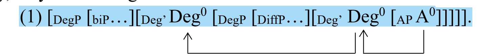

# Ch4 汉语承担“大于义”的句法成分和位置；差别短语的生成方式

## 4.1.1 中文DegP-Shell整体结构介绍

**P70：**

1. 在英文的DegP理论中，形容词被DegP允准，中文也如此。
2. Deg0中包含两类语素，pos和comp（更，比较，多或者null，null comp对等英文的er/more）。
3. DiffP是下层DegP的specifier，被（Deg0+A0）控制。且DiffP分三种，O,o，精确值。（`O和o为什么不一样，非否定句是不是一样的，反正否定句不一样，可以提，不解释。`）
4. “比”是“标准”的Marker，可以选择NP或者CP做complement。

**P71：**

为什么要有comp：下层Deg0不能空，否则语义类型对不上，需要一个type shift，以及没有人可以承担“greater than”的含义。（例句是A比B高2cm，这里高不可以承担than的感觉）。

diffP的位置：下层DegP的specifier，原因有二。一是，diffP被Deg0的“greater than”语义引出，因此DegP的specifier是最佳位置。二是，形容词和degree head共同决定了diffP的位置，是个提升规则，具体在4.2.3和4.2.4节（`写的什么屎，它最好真的在，它还真讲了`）。

**P72：**

中文的degShell和英文（Larson）的标志性区别，最下层三角形不一样。也就是AP的位置不一样，调整AP的位置可以更适应中文。

比较语义学的一个潜规则：standardP和diffP由Deg0引入(`那行吧`)。

## 4.1.2 利用结构分析一手

**P73：**

语义计算的核心是从adj开始（`废话`）。对于adj的语义，主要问题是，怎么抽象区别有级的和无级的，于是有级的形容词，语义形式上要带个度量。

高在语义分析的时候，多摘出去一个$\lambda$，这样可以和无级的形容词做区分。

`但是这是放屁。作者认为无论pos形式还是compara形式，都可以摘出去。但是我们认为不可以。否则会有“As “John is 2 meters tall” does not deny the possibility that John is taller than 2 meters”的傻逼意思。`

`并且这个例子，A有2m高。作者认为是pos形式，我们认为这里的高就不是形容词，更不存在pos形式。`

**P74：**

最简单的两个例子：A比B高。A比B更高。这里的comp和geng的语义分析为：

$$
comp_1=λG_{<d,<e, t>>}λyλx.[Max d_1(G(x)(d1)) > Max d_2 (G(y)(d2))] \\
geng_1=λG_{<d,<e, t>>}λyλx.[Max d_1(G(x)(d1)) > Max d_2((y)(d2)) \\ \land Max d_2(G(y)(d2)) ≥d_{stnd}]
$$

在这个基础上，更复杂的两类例子。

1. 带diffP

A比B高一点。A比B高2cm。因为diffP本身是个d，所以针对性的，comp和geng需要调整语义类型，再挖一个d出去。
$$
comp_2=λG_{<d,<e, t>>}λdλyλx.[Max d_1(G(x)(d1)) \geq Max d_2 (G(y)(d2)) + d] \\
geng_2=λG_{<d,<e, t>>}λdλyλx.[Max d_1(G(x)(d1)) \geq Max d_2((y)(d2)) + d \\ \land Max d_2(G(y)(d2)) ≥d_{stnd}]
$$

2. biP后面跟从句

A在家比B昨天在学校更开心。->A在家 比 [B昨天在学校pos~~开心~~] 更 开心。

核心是作者认为biP后面的从句是<d,t>，因为从句本身肯定是t，既然要比较，挖一个d很合理吧，所以是<d,t>。于是继续调整comp和geng的类型。
$$
comp_3=λG_{<d,<e, t>>}λD_{<d,t>}λyλx.[Max d_1(G(x)(d1)) \geq Max d_2 (D(d2))] \\
geng_3=λG_{<d,<e, t>>}λD_{<d,t>}λyλx.[Max d_1(G(x)(d1)) \geq Max d_2(D(d2)) \\ \land Max d_2(D(d2)) ≥d_{stnd}]
$$

英文里的G和D可以不一样（subcomparatives），但是中文必须一样。`那上面两个式子在中文下应该可以再简单点。`

但是上面的式子抽象都还不够，开心有时间和地点，所以还得抽象。`一整个无语，家人们谁懂啊，你抽象了时间地点，你要不要把人物天气都抽象了？这里我看可以迭代，引入可变长度参数Arg..，进行一个std::forward`。
$$
comp_4=λG_{<d,<l,<i,<e,t>>>>}λD_{<d,t>}λlλiλx.[Max d_1(G(x,l,i,d_1) > Max d_2(D(d2))]
$$
接下来作者也用跑得快的例子说了参数太多的问题。`他是直接合并成了一个v，形式上可以做的再好看点。`

## 4.2.1 什么是DegP

都是历史。

**P77：**

解释了一下pos是跨语种的，把pos引入到中文中。

## 4.2.2 汉语中的比较语义

### 4.2.2.1 很，更，最

对应英文much，more，most，表达postive，comparative，superlative。

**P80：**

除了superlative和equative，中文的更和英文的more，在不带显示biP句子中的成分差不多。

**P81:**

从语义角度，中文想构成comparative需要两个marker，分别是介词“比”和副词”更“。只有他们同时存在，才能表达“标准”和“大于”。但是从句法上，任意一个存在就构成comparative。（`句法的comparative是怎么定义的？`）

进一步的。

1. 带“更”的comparative和postive modifier“很”矛盾。（`需要整理，是不是能够枚举的两个位置的词都矛盾。`）
2. “更”只有大于意，大于多少交给diffP承担。（`没毛病`）
3. 有一个没有详细阐述的规则（`有展开空间`），A比B更聪明，A比B更加聪明都可以。但是“更多人”可以，“更人”不行。某种条件下，更后面必须带个东西。
4. “更”带有暗指，A比B更高，暗指B本身很高。（`我觉得有空间，这个暗指不绝对，如果是这么说：“B比C高，A比B更高”，感觉没有暗指B很高，只是句子之间的程度副词`）。

**P82：**

复读，中文句法上构成comparative是单mark的。

相比较英文中的more，中文的比较词往往携带一些暗指，比如“更”携带postive含义，“还”携带反期望含义。基于此，如果希望中英有一个严格对应，那么中文必须有一个元素和more/er一样承担纯粹的“greater than”，于是comp位置就有一个空语素null。（`这里其实可以做文章，按照作者的理解，这个comp要么有词，要么是null，是null的时候，这个null承担纯粹的greater than，如果不是null，那么词承担greater than外加一个暗指。那么大胆点，有没有可能把这两个拆开。`）

”更“和”more“跟diffP的时候，英文的自由度更高。比如A比B更高2m不对，用more的英文是对的。

**P83：**

此外，有的时候更的diffP不能是大O，比如A比B更聪明很多就怪怪的，但是英文可以。（`只阐述了现象，没有解释原因啊`）

反义词比较，英文可以在一句话里，中文得两个从句。

更和非常的三点区别：

- 非常可以重复，这里没有解释，转第六章解释。
- 更可以带diffP，非常不可以（`没解释为什么`）。
- 和疑问句有关（`没看懂`）。

### 4.2.2.2 null comp

**P84：**

null comp对diffP没选择性，大O，小o，精确值都可以。

在众多diffP中，“很多”比较特殊，可以跟可测的adj也可以跟不可测的adj。高很多，聪明很多。等。于是，通过“很多”能不能塞到句子里，可以判断null comp的存在，能塞进去就是有null comp，不能塞进去就说明有别的comp在了（`惊了`）。

中文比较中，有两个null，null pos和null comp。两个都null时有时会混淆时positive还是comparative，这个时候加一个“很多”，就可以消除postive含义。（`迷惑，意义何在，是听不懂中文，要推理的吗`）

**P85：**

用一段说明“更”和“2m”不兼容。因为2m暗指一个pos，pos在lower Deg0位置，更是comp，也是lower Deg0位置，所以矛盾。（`但是这个事有问题，首先矛盾很显然，按之前的说法，更只能引导小o的diffP，当然和2m这种精确diffP不兼容。但是它的解释有问题，2m暗指pos，意思是2m出现了就是postive formal？我就是比他高两米，我长四米不行？`）

**P86：**

讨论“出”和”过“的位置。一大堆前人认为出和过是另外一个null位置。但是作者认为不对，理由有三。

1. 出和过本身出现就不普遍，高，长，快可以跟出和过，短，矮，重就跟不了。
2. 如果认为出和过是一个空位置，无法解释为什么针对一些句子，出和过不行，但是空位置可以。比如”A比B高“。理解为”A比B高[空]“没问题，但是理解为”A比B高出“就G了。
3. 按照前人的理论，”了“和”高/出“是一个位置，这样就无法解释为什么，可以矮了短了重了，不能矮出短出重出，无法解释二者分布的不同。

于是作者把高和出/过粘在一起，站起来以后，就必须要带一个diffP。并且没要求，大O小o精确值都行。位置还是comp。语义形式也不变。（`P88-P90这里之后再看下`）

### 4.2.2.3 更

### 4.2.2.4 多

# 梳理

给出句法树，对于每个位置：

- 讨论存在性：为什么一定要有这个位置（pos和comp）。成句机制，语义角度，评价意角度，承担功能角度。
- 语义演算：在不同成分出现/不出现时，应当有不同的演算，和存在性相耦合，行文结构需要考虑。
- 对应位置在英语里是什么：穿插进字里行间，单独成节意义不大。

meaning有四种，positive meaning, comparative meaning, equative meaning, superlative meaning。其中comparative meaning和equative meaning并称到comparative form中。form一共三种。也就是postive form，comparative form和superlative form。

基于此。推理顺序。

1. 枚举四种form下的需要解释的所有例子。
2. 每种form内部句法树需要完备。
3. 争取四种form句法树融合（但是可能不一定搞得定）。
4. 语义计算和句法树不一一对应，需要每种case推理通顺。

# 例子集合

*A高

A高2m

A不高

A很高

A比B高

A比B更高

*A比B很更高

A比B高2cm

*A比B更高2cm

A比B高出2cm

A比B高一点

A比B更高一点

*A比B非常高一点

A在家比B在学校高兴

A今天比昨天高兴

A和B一样聪明

A比B更聪明

A比B更加聪明

A比B聪明

*A比B更聪明很多

A比B更聪明一点

A和B一样高

A和B一样高2m（博士觉得这个不对，我觉得是通顺的）

*A和B一样高一点

今天比昨天人多

今天比昨天人更多

今天比昨天人更加多

*相比昨天，今天有人

*相比昨天，今天有更人

相比昨天，今天有更多人

*这下，我对他更崇拜

这下，我对他更崇拜了

# Noemie

Mandarincomparatives are hypothesized to derive under a ==shell of DegP==：（1）

> ## 

> Mandarin gradable adjectives are also licensed by a functional DegP, headed either by  positive morphemes or by comparative morphemes, and the latter contains a null  “comp”, “geng(more)”, “hai(more)”, “duo (more)”, bijiao(comparatively), etc. Differential phrases and “biP” are respectively assumed to occupy the specifier of  lower DegP and the specifier of upper DegP. A series of head movement from A0 to  Deg0 to Deg0.

In semantics, “comp” is encoded as a three-place function, identifying a “greater  than” relation between the referent (subject) and the standard (biP)，where it successively absorbs G, y and x, with “G” symbolizing “gradable adjectives”, “y” the  standard individual denoted by “biP”, and “x” the referent individual denoted by  subjects：(2c)

> (2c) comp3=λG>λDλx.[Max d1(G(x)(d1)) > Max d2 (D(d2))]

*“Mandarin still  maintains a single marker to distinguish comparatives from others, but the single  marker can be either instantiated as the preposition “bi(than)” or the comparative  morpheme “geng(more)”.”*