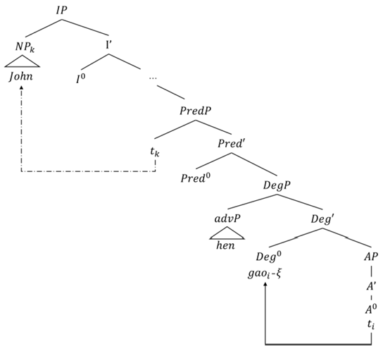
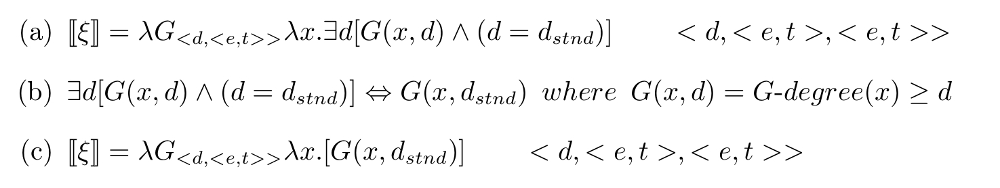
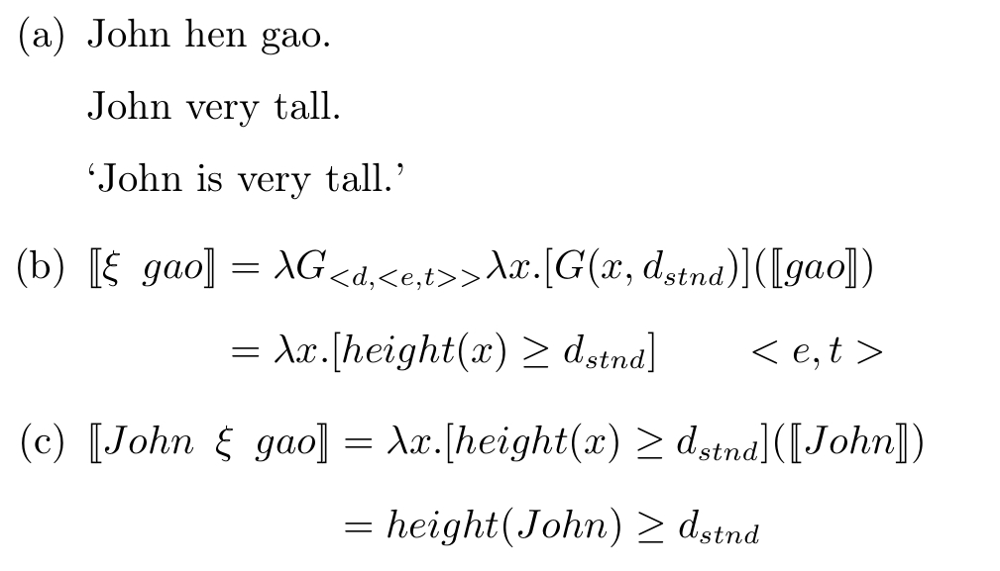
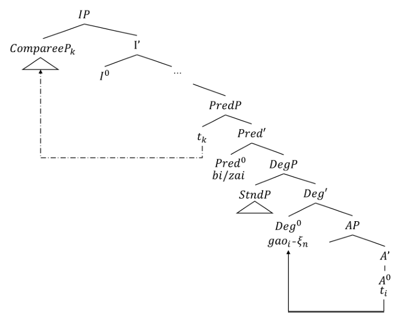
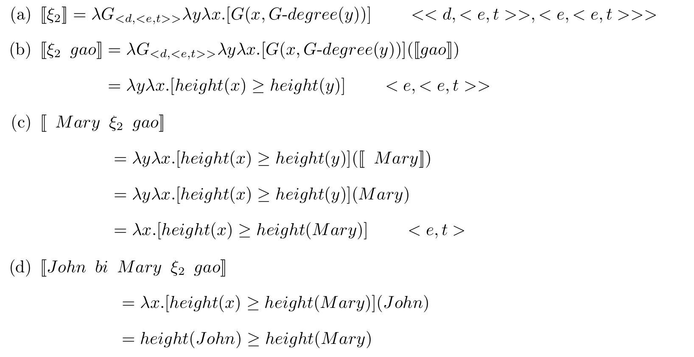
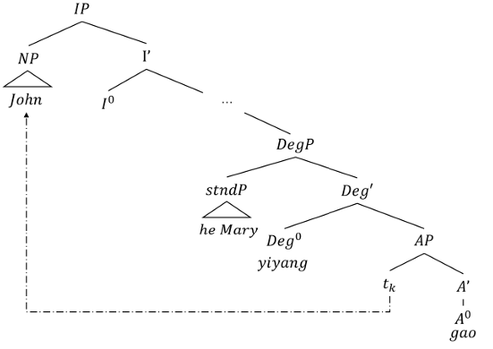
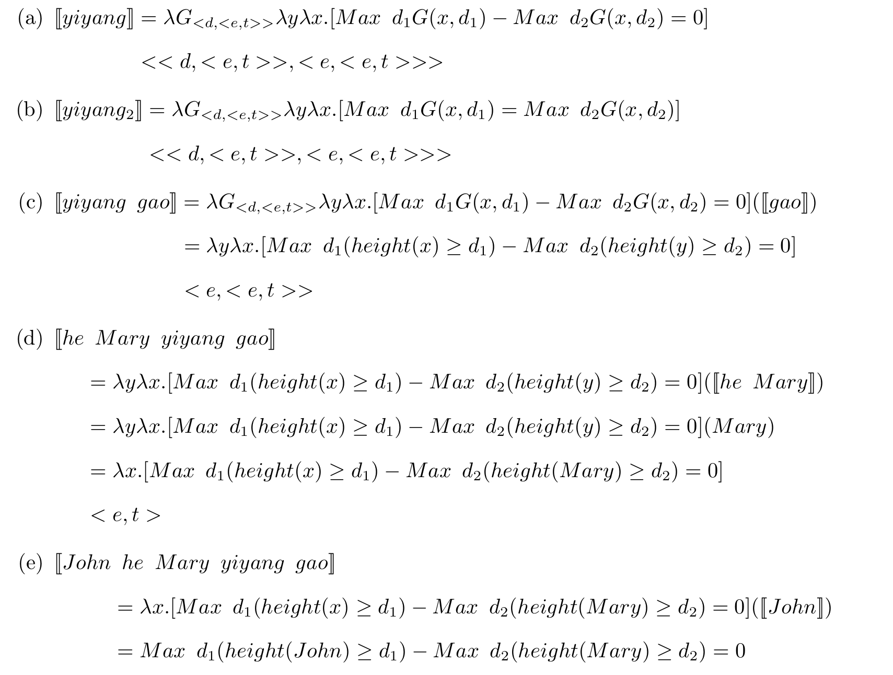

# Abstract

This paper focuses on sentences built around gradable adjectives, especially measurable ones, used as predicates in Mandarin. These sentences are classified as expressing assignable meaning or comparative meaning according to the lexical entry of the gradable adjective. In terms of the latter type, sentences are further divided into three subtypes, i.e., positivity, superiority and equality. 

The whole research is conducted under the theoretical frame of generative syntax and formal semantics. The paper attempts to give a complete analysis integrating syntax and semantics. DegP hypothesis and DegP-shell are the two main cornerstones of this research.

For the syntactic part, this paper assumes a perspective of the complementary distribution of **DegP-AP** and **DegP-DegP-AP** structures. In detail, the higher DegP serving to introduce the standard is consistently projected, while the lower DegP severing to introduce the gap between the comparee and the standard is projected on the condition of the appearance of a differential phrase strictly greater than zero. 

For the semantic part, this paper makes a clear division of labour among the gradable adjective, the lower functional degree head and the higher functional degree head. Thanks to this division, wrong readings of some constructions on gradable adjectives derived out via previous analyses are successfully corrected. Detailed semantic formalizations and calculations are illustrated with examples of different types of constructions built around gradable adjectives. 

## Example in Positivity

### AST

### Sematic

The meaning of the sentence in 'John hen gao.' can be figured out successfully following the semantic calculations illustrated below.

## Example in Superiority

### AST

### Sematic

## Example in Equality

### AST

### Sematic

