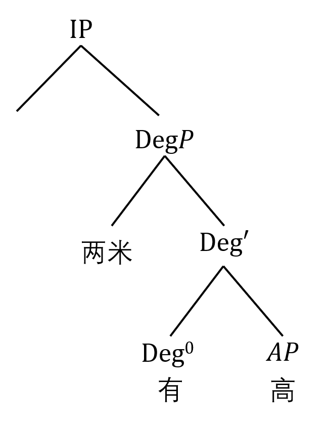
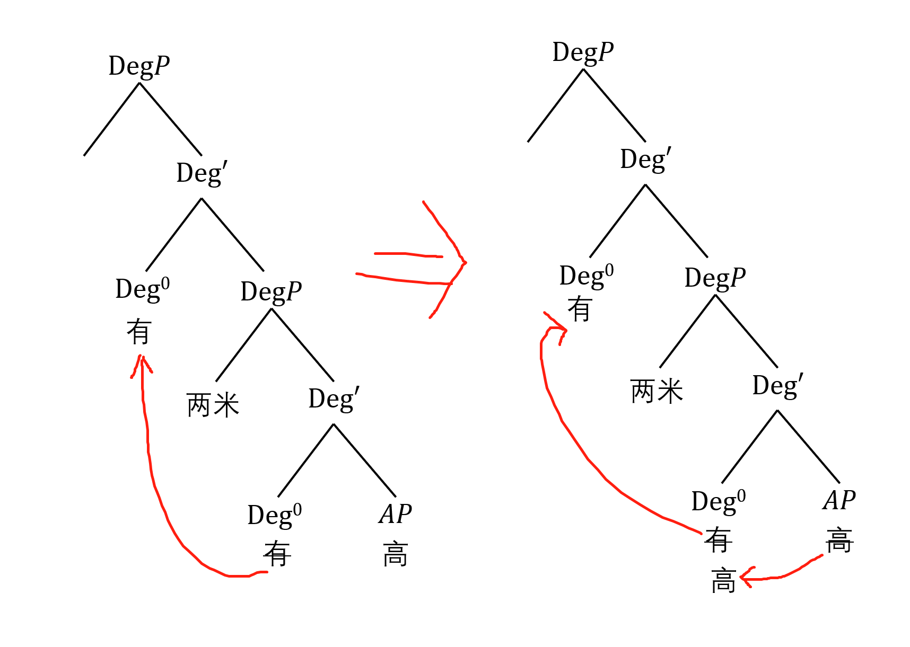

# 简要大纲

`研究范畴，DegP-DegP-AP（不带V！！）。不研究DegP-DegP-VP。只研究simple-declarative forms - 否定句。`

比如：多买两本书，跑得快，长得高，都不会研究，搞不定，会颠覆整个大厦，不兴研究，不兴研究！

## 2. ？？？

### 2.1 DegP-Hypothesis

目标》DegP（句法）-d（语义）。

直觉上，一个主语和一个形容词就成句。对应到句法上，就是AP之有两个部分，主语在Specifier的位置，adj在head。对应到语义上就是形容词的lecial entry是<e,t>类型。但是，xxx提出，这里要把形容词区分成，gradable adj和non-gradable，对前者需要以一个d类型。。。（总之，把intro粘贴过来）

然后，DegP对应IP和DP这里稍微展开一下。

### 2.2 DegP-Shell以及DegP-Shell中会出现的成分

#### 2.2.1 DegPS的由来

DegP-H只有一层结构，但是发现不够用在加一个。（这里最好给个例子说明为什么DegH中一层结构解决不了问题，要套娃）。

然后，说明DegPShell是对VP-Shell的一个模仿，稍微展开一下。

#### 2.2.2 成分

DegPS中的出现的Constituents。枚举：（这里需要一个一个例子列出来，且带解释，类似博士论文（几个例子一段话，几个例子一段话））

1. gradable-adj：高矮胖瘦
2. 被比较的对象：没啥说的，提一下
3. 比较对象：有可能是一个人（A比B高），有可能是个体的集合（在一个班中，A最高），还有可能是一个标准（A很高）。

> `论点`：对postive form，comparative form（conmparative meaning + equative meaning），superlative form进行重定义，就是比较对象的类型。

> `论点`：无论是哪种form，比较对象都是可以必须的。区别在于可能是implicit或是explicit。但是一定存在。表面看起来A很高没有比较对象，但是暗含了和一般标准比较。等反正来几个例子。

4. Algebraic-construction：（别急）

5. functional morphemes：大概是pos和comp（别急）
6. modifer等：后面也不研究，提一下完事。

## 3. ？？

### 3.1 我的DegP长什么样子

> 说明两层结构的功用。不管是pos form还是comparative form，有两个成分有可能会出现。`比较组分`成分和`代数组分`成分，比较组分和其他个体建立比较关系，代数组分成分负责赋值。

例如，在equative meanings下，==A和B一样有两米高==。既有比较组分也有代数组分。==A和B一样高==。只有比较组分，没有代数组分。==A有两米高==，表面上看只有代数组分。所以比较组分一定有，代数组分不一定。

Comparative meanings中，也是类似。==A比B高2m==，==A比B高==，但Comparative Meanings中看起来很难做出表面上只有代数组分的句子（`论点`）。

在DegP（比较组分）DegP（代数组分）Ap这中树下，比较组分成分是compulsory，代数组分成分是optional的。

**举例**：equative：A有两米高

看起来只有代数组分，但是实际上是有问题的，如果没有比较组分，这句话的tree是：

> Remark：这里“有”在下Deg0，有没有可能在上面呢？我们反正认为是在下面：因为我们的假设里，代数组分是用来解释赋值的，“有”的含义更接近与去赋值。

这样的话，语序是==A两米有高==。因此需要比较组分成分来帮助提升。

提升的原因，目前有两想法：

a）没有语音形式的head不能独立存在 -> 有和高都要上移，如上图

b）给两米一个patient role --> 导致只有有上移

在这个例子下，上面两个原则都可以解释，如果是b解释，只有有动，高不动->这个例子无法分辨高到底动不动->导致，无法分辨哪个上移原因是对的。

**举例**：equative：A高两米

是上面例子的变体，==A有两米高==变成==A高两米==。没有“有”了，所以高必须升两次。侧面证明上面的两个提升原则中，a是对的。

> 在comparative中，有个问题，==A高B2m==的生成目前解释不通，先放着。

可能的solution: 《现代汉语生成语法》==我给李四送了一本书。我送（给）了李四一本书 （VP-shell）。==类比==小明比小红高了/高出2厘米。小明高了/高出小红2厘米。==

### 3.2 和现象的适配性

# 零散想法

## 想法一，说明博士论文中关于pos反直觉的部分

看==A高2m==的用之前的祖宗之法能不能会不会推出反直觉的含义。
$$
[\![gao]\!]=\lambda d \lambda x.[height(x) \ge d] \qquad <\!<d, <e, t>\!>
$$
小明很高的pos，冗余的表达：
$$
[\![pos_1]\!]=\lambda G_{<d,<e,t>>} \lambda x. \exist d [G(x,d) \wedge (d > d_{stnd})] \qquad <\!<d,<e,t>\!>,<e,t>\!>
$$
我觉得的表达：
$$
[\![pos_1]\!]=\lambda G_{<d,<e,t>>} \lambda x.[G(x,d_{stnd})] \qquad <\!<d,<e,t>\!>,<e,t>\!>\!>
$$
小明高两米的pos：
$$
[\![pos_2]\!] = \lambda G_{<d,<e,t>>} \lambda d \lambda x.[G(x,d)] \qquad <\!<d,<e,t>\!>,<d<e,t>\!>\!>\!>
$$
那么：
$$
\begin{equation}
\begin{split}
[\![pos_2 \enspace gao]\!] 
&= [\![pos_2]\!]([\![gao]\!]) \\
&= \lambda G_{<d,<e,t>>} \lambda x.[G(x,d_{stnd})](\lambda d^{\prime} \lambda x^{\prime}.[height(x^{\prime}) \ge d^{\prime}]) \\
&= \lambda d \lambda x. [G(x, d)]
\end{split}
\end{equation}
$$
于是：
$$
\begin{equation}
\begin{split}
[\![2m \enspace pos_2 \enspace gao]\!] 
&= [\![pos_2 \enspace gao]\!](2m) \\
&= \lambda d \lambda x. [G(x, d)] (2m) \\
&= \lambda x. [G(x, 2m)]
\end{split}
\end{equation}
$$

`所以论点：赋值的关键是要提取最大值，才能进行直接赋值。不然会使得Height(x)变成一个区间。最后导致反直觉的含义。`

因此我认为：
$$
[\![pos_3]\!]=\lambda G_{<d,<e,t>>} \lambda d \lambda x.[Maxd^{\prime}(G(x,d^{\prime}))=d]
 \qquad <\!<d,<e,t>\!>,<d<e,t>\!>\!>\!>
$$
这样就解决了上面的歧义问题。

接下来考虑==A和B一样高2m==，做出：

> Larson (1991) proposed a version of semantic interpretation of comparative
>  meanings in accordance with the DegP-shell structure. He develops his derivation 自己的成果有 from the strategy of Klein (1980, 1991) via a utilization of negative operator. 了，踩一脚前 As mentioned in chapter two, Larson does not get himself involved with 人，落井下石 differential phrases and his semantic representation of (15a), i.e. (15b) seems leave no
>  possibility to incorporate differential arguments. One possible revision may
>  be found in Schwarzschild (2005, p212), but with a drop of negative operator
>  and regarding DiffPs as a generalized quantifier.
>
> (15) a. John is (2 inches) taller than Mary. 
>
> ​		b. ∃d [「tall’(Mary, d) ∧ tall’(John, d)]

这段好有道理啊。

## 想法二 

### 独立词和词缀的区分

论点1：出的位置和有的位置是一样的，都在下层Deg0（这里可以引大批文献）。

论点2：==有==是词，==出==是语素。词和词是竞争关系，语素和词是合作关系。考虑下面两个句子的生成。

==A和B一样有两米高==和==A比B高出两米==，前者因为==有==的占位，==高==不能继续先前提。后者==高==先和==出==这个词缀一起形成==高出==，再一起上移。

论点3: 黏着语素和词需要结合才可以使用，所以词需要上移（黏着语素：无语音形式（零形式）或者有语音形式，见《现代汉语生成语法》）。

论点4: “有2米”在[Spec, (lower)DegP],类似“比小红”在[Spec, (higher)DegP]，构成论元交替结构。“==我给李四送了一本书”“我送（给）了李四一本书”==

## 想法三：equative meaning 和 comparative meaning要分两种不同结构来搞

